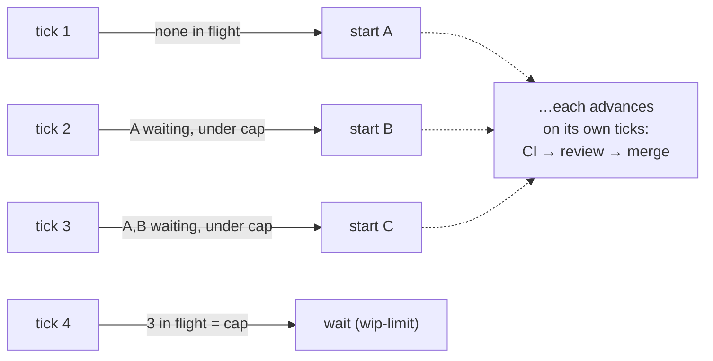

# RFC 001: Parallel task execution

## Status

**Proposed.** The keystone (WIP cap + in-flight dedup) is implemented and shipped at `maxConcurrentTasks: 1` (single-track, no behaviour change). Everything beyond that — actually running independent tasks concurrently — is future work gated on a `dab` readiness model. This RFC records the target design so it can be built deliberately.

## Context & Motivation

Today the factory works one task at a time. Throughput is bounded by the slowest step of a single task's lifecycle (implement → CI → review → merge), even when the backlog holds several tasks with no dependency on each other. If three independent tasks are ready, there's no reason a developer session can't be working all three at once. The goal is to let independent work proceed in parallel, capped by an explicit limit, without weakening any of the properties that make the current system trustworthy.

## Non-goals

- **Multiple orchestrator processes.** The orchestrator stays a single coordinator. Running several would reintroduce exactly the assignment-race problem this design avoids (see Alternatives).
- **Autonomous pull-based workers.** Developers remain short-lived, single-task, dispatched sessions. They are handed a task; they do not pull from a queue.
- **Parallelism across *dependent* tasks.** Ordering within an epic (phase 2 needs phase 1) must be respected. Parallelism applies only to genuinely independent, *ready* work.

## Background: how coordination works today

Three facts from the current design ([PRINCIPLES](../../../docs/architecture/PRINCIPLES.md), [ADR 001](../../../docs/architecture/adr/ADR_001_DETERMINISTIC_ORCHESTRATOR.md), [ADR 002](../../../docs/architecture/adr/ADR_002_RECONCILE_STATE_FROM_REALITY.md)) make parallelism largely a matter of *removing a bottleneck*, not adding a mechanism:

1. **The orchestrator is the sole dispatcher.** Nothing else starts work. There is exactly one place assignment decisions are made.
2. **`state.json` is the assignment ledger.** Every in-flight task is recorded there with its branch. The orchestrator already knows, at all times, what is in flight and what isn't.
3. **The loop is level-triggered.** Each tick re-derives the next action from reality and does one thing. Run it repeatedly and it advances whatever is ready.

Because there is one dispatcher and one ledger, **collision-free assignment is free** — no two workers can be given the same task, because a single deterministic process hands out the work and records it. This is the crux of the decision below.

## Proposed Architecture & Design

### 1. Push, not pull — the orchestrator assigns

Keep the orchestrator as the assigner. Do **not** have developers claim tasks from a shared queue. Worker-side claiming exists to coordinate *autonomous* workers with no central authority; it needs atomic claims/locks to avoid double-grabs. The factory has a central authority (the orchestrator) and a ledger (`state.json`), so claiming would import a distributed-coordination problem the architecture otherwise doesn't have. `dab claim` / an `in-progress` board status remains useful only for **observability** (making the board show what's being worked), and even that is already visible via `--status` reading `state.json` — it is not load-bearing for coordination.

### 2. Parallelism emerges from the level-triggered loop

No worker pool, no multi-threading. With an in-flight dedup and a WIP cap, the existing one-action-per-tick loop fans out on its own across successive ticks:

Under a scheduled loop ([ADR 006](../../../docs/architecture/adr/ADR_006_HUMAN_MERGE_GATE_AND_BUDGET.md)'s deferred next gate), this happens automatically; the loop starts new ready work each tick until it hits the cap, and the in-flight loop keeps every started task moving.

### 3. The keystone (implemented)

Two changes, both shipped, both no-ops at `maxConcurrentTasks: 1`:

- **WIP cap** (`config.maxConcurrentTasks`, default 1): the orchestrator only *starts* new work while the count of in-flight tasks (tracked in `state.json` with a branch) is under the cap. Already-started work always keeps advancing — the cap gates *starting*, not *finishing*. Distinct from `budget-guard`, which caps dispatch *rate*, not concurrent *count*.
- **In-flight dedup**: the new-work paths never re-dispatch a task already tracked in flight (they return `wait: next-task-already-in-flight`). This also fixes the pre-existing latent bug noted in [ADR 008](../../../docs/architecture/adr/ADR_008_READ_ONLY_CHECKOUT_COMPLETION_IN_PR.md) (a task still `active` on `main` while its PR is open being re-picked by `dab next`).

At the default cap of 1 this reproduces today's single-track behaviour exactly — but *correctly* (via an explicit cap) rather than accidentally (via `dab next` re-returning the in-flight task and being skipped by the running-session guard).

### 4. Required future work (the actual parallelism)

Raising the cap above 1 does nothing useful yet, because of one missing piece:

1. **A `dab` readiness model — the substantial piece, and it lives in `dab`, not the factory.** Today `dab next` returns *one* task by its own priority, and it keeps returning a still-`active` in-flight task rather than the *next* one, so the loop can't advance to a different task. Parallelism needs `dab` to answer *"which unstarted tasks are ready right now?"* — a list, excluding in-flight ones, that respects dependencies. Concretely, some combination of:
   - a `dab ready --json` that returns all unstarted tasks whose predecessors are complete;
   - an explicit dependency/`depends_on` field, or phase-gating (a phase's tasks become ready only when the previous phase is fully merged);
   - a way to pass the in-flight set so already-started tasks are excluded.
2. **Multi-candidate selection in `decide()`.** Once `dab` can return a ready-list, `decide()` picks the first ready task **not** already in `state.json`, up to `wipLimit - inFlightCount`. Either dispatch several per tick, or keep one-per-tick and let rapid/scheduled ticks fan out (simpler, and truer to the level-triggered model).
3. **Merge-conflict handling.** Parallel PRs touching the same files will conflict. `findPrForBranch` already reads `mergeable`; `decide()` should act on `CONFLICTING` by dispatching the developer to rebase/resolve, rather than leaving the PR stuck.

## Alternatives considered

- **Pull model / worker claiming.** Rejected: it solves a problem (no central coordinator) the factory doesn't have, and adds claim races/locking. See Proposal §1.
- **Multiple orchestrator processes.** Rejected as a non-goal: horizontally scaling the *coordinator* would make assignment concurrent, which is exactly when you'd need claiming/locking. One deterministic coordinator sidesteps the whole class of problem; the workers are already the parallel part.
- **Dispatch N developers in a single tick.** Possible, but dispatching one-per-tick and letting the level-triggered loop fan out is simpler, keeps each tick's decision atomic and auditable, and composes naturally with the scheduled-loop gate. Preferred.

## Risks & open questions

- **Reviewer throughput.** One `ls-reviewer` identity reviews serially. N parallel PRs queue for review; probably fine, but review may become the bottleneck instead of implementation. Worth measuring before raising the cap far.
- **Cost.** N concurrent agent sessions is roughly N× spend. The WIP cap and `budget-guard`'s rate limit together bound this; their interaction should be made explicit (WIP caps concurrency, budget caps starts-per-window).
- **Local resource pressure.** Each in-flight task is a git worktree + a background session. Many at once stresses disk and the machine; a practical ceiling exists well below "unlimited."
- **External rate limits.** More parallel work means more concurrent `gh`/CI/API load; watch for throttling.
- **Failure isolation.** A task that keeps failing review shouldn't stall the others. The in-flight loop already advances tasks independently, but escalation (the 2nd-rejection → architect path) and a possible "park this task, keep going" state need thought at higher concurrency.
- **Dependency correctness is safety-critical.** The entire benefit rests on the `dab` readiness model being *right* — dispatching a dependent task early (e.g. the Biome cutover before its config exists) produces wrong or conflicting work. This is why cap stays at 1 until that model is trustworthy.

## Rollout

1. **Done:** keystone (WIP cap + dedup) at `maxConcurrentTasks: 1`. No behaviour change; latent bug fixed.
2. Build the `dab` readiness model + `decide()` multi-candidate selection + conflict handling.
3. Raise the cap incrementally (2, then higher) against a real backlog of independent tasks, watching reviewer throughput, cost, and machine load — the same "relax a gate only once it's earned" posture as [ADR 006](../../../docs/architecture/adr/ADR_006_HUMAN_MERGE_GATE_AND_BUDGET.md).
