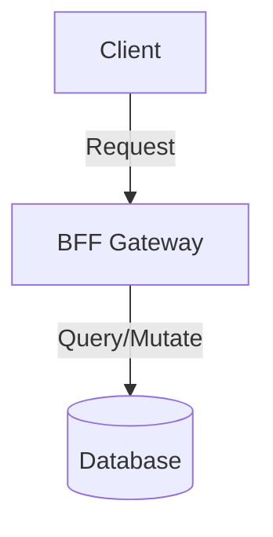

# RFC: [Design Proposal Title]

- **Status**: [Draft / Proposed / Approved / Rejected]
- **Author**: [Your Name / Agent]
- **Date**: YYYY-MM-DD

---

## 1. Context & Motivation

[Describe the problem or limitation of the current system. What are the business and technical goals of this change?]

## 2. Proposed Architecture & Design

[Detailed technical description of the proposed solution. Include interface API contracts, database schemas, sequence flows, and Mermaid diagrams where applicable.]

### Data Flow / System Schema (Mermaid)

## 3. Alternatives Considered

- **Alternative A**: [Brief description and why it was rejected (e.g. high latency, complex tooling, security gaps).]
- **Alternative B**: [Brief description and why it was rejected.]

## 4. Risks & Open Questions

- [ ] List any uncertainties, third-party limits (like LLM quota limits), or migration risks.
- [ ] Open Question 2
