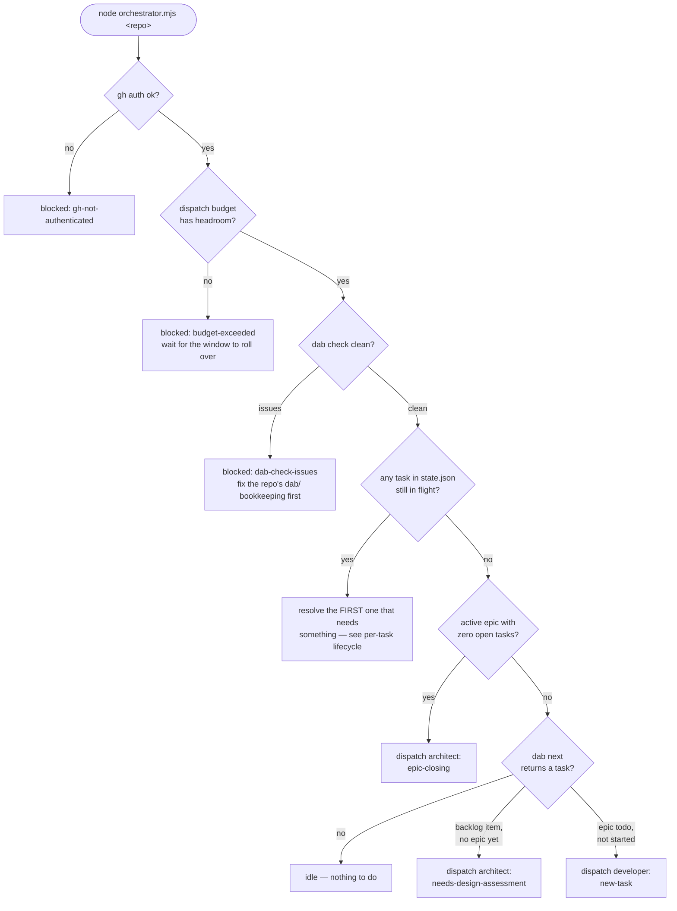
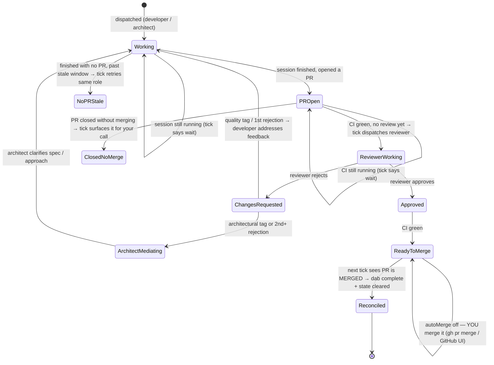

# Orchestrator state machine

> Read [PRINCIPLES.md](PRINCIPLES.md) first for *why* it works this way. This document is the *what*: the concrete states, transitions, and "when do I run it?" mechanics.

The single most important thing to understand: **the orchestrator has no memory of its own and never polls.** Every run of `node orchestrator.mjs <repo>` is a fresh, one-shot process. It looks at everything fresh — `dab`, GitHub, and any background agent sessions — makes exactly **one** decision, acts on it, and exits. Nothing happens between runs. If you want it to notice that a PR opened, a review landed, CI finished, or you merged something — you have to run it again. There is no daemon (yet) watching for you.

The only thing remembered across runs is `state/<repo>.json`, which holds the minimal "task X → branch Y, last role Z" thread. Everything else is re-derived from scratch every tick.

## What one tick actually does (priority order)

The orchestrator checks things in a strict order and stops at the first thing that needs doing. It never does two things in one run.

## Per-task lifecycle

Once a task is tracked in `state.json`, this is what each tick checks for it. Developer work, architect RFC/epic work, and epic-close all flow through the same shape — only the dispatched **role** and what it produces differ. This is the part that answers "do I need to run it right now?"

`ReadyToMerge` is the only state whose behaviour depends on config. With `autoMerge: true` (the current setting since 2026-07-20) a tick merges the approved, green PR itself (squash + delete branch) and reconciles — the loop is fully hands-off from dispatch to merge. With `autoMerge: false` it instead stops here, reporting `would-merge`, until a human merges. Everything else resolves itself across ticks without you doing anything but re-running the command.

Note that a PR closed or merged **through any channel** — GitHub's web UI, `gh pr merge` run by hand, auto-merge — is caught: the tick queries GitHub for PRs in *all* states and reconciles accordingly (`MERGED` → clean up; `CLOSED` without merge → surface for a human). This is the level-triggered principle in action ([ADR 002](adr/ADR_002_RECONCILE_STATE_FROM_REALITY.md)).

## Cheat sheet: when do I need to run it?

**The short answer: run `node orchestrator.mjs <repo> --status` (read-only) and look at the headline.** It reconstructs the exact reality a tick would see and tells you whether a tick would act (`▶`), wait (`⏸`), or is blocked (`⚠`) — so you never have to guess or go check GitHub yourself. Run a real tick when it says `▶`. `--watch` refreshes it on a timer. The table below is the underlying logic that verdict is computed from.

| What just happened | What the next tick will do |
| --- | --- |
| Nothing dispatched yet, epic has unstarted work | Dispatches a developer for the next task |
| You just got a `dispatch` line | Nothing to check yet — running again immediately just says `wait` |
| A background session finished (`claude agents --json` shows `idle`/`done`, or check `claude logs <id>`) | Run it — it notices the resulting PR and dispatches the reviewer once CI is green |
| A review just landed (approved or changes-requested) | Run it — dispatches developer/architect to fix, or (with `autoMerge` on) merges the approved, green PR itself |
| CI still running on an open PR | Running now just reports `wait` — nothing to do until CI finishes |
| A PR is approved + green (`autoMerge: true`, current) | Run it — the tick merges it (squash + delete branch), runs `dab complete`, clears state, all in one step |
| You see `would-merge` (only if `autoMerge` were off) | **You** run `gh pr merge <PR>` yourself, then run the tick again so it reconciles state |
| You merged a PR yourself, outside the orchestrator | Run it — the next tick reconciles state (`reconciled-merged`) before considering anything else |
| An epic's last task just got reconciled | Run it again — *this* tick notices zero remaining tasks and dispatches the architect to close the epic |

In short: **run it any time something external changed** (a session finished, CI finished, a review landed, you merged something) **and you want the orchestrator to react.** Running it with nothing changed is harmless.

## Decision vocabulary

Every tick logs one JSON line to `logs/<repo>.jsonl` with a `type`:

| `type` | Meaning |
| --- | --- |
| `dispatch` | Started an agent session (a `role` + `reason` say who and why) |
| `skipped-dispatch` | Wanted to dispatch but a same-named session is already running |
| `wait` | Something's in progress (CI, a running session) — nothing to do yet |
| `would-merge` | A PR is approved + green and ready; `autoMerge` off, so waiting on a human |
| `reconciled-merged` | Noticed a PR merged out-of-band; caught state up (`dab complete` + cleared) |
| `merged` | The orchestrator merged it itself (only when `autoMerge` is on) |
| `blocked` | Can't proceed: gh auth, budget, dab-check issues, or a PR closed without merging |
| `idle` | Nothing to do at all |
| `error` | The decision step threw |
