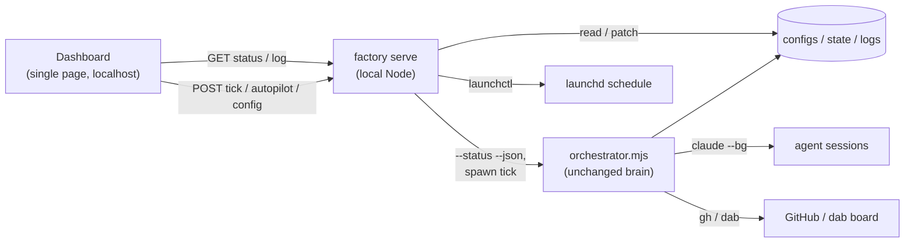

# RFC 002: Factory control UI

## Status

**Implemented.** The local dashboard (`server.mjs` + `ui/`) exists and has grown past this RFC's original MVP scope: the tick button with SSE streaming, the decision-log timeline, and repo/config views described below all shipped, plus features this RFC didn't anticipate — kill-stuck-session, a live processes view, bug-report snapshotting, and the cross-repo portfolio view ([RFC 005](RFC_005_SPRINT_ORIENTED_PLANNING.md) §6).

## Motivation

Today the factory is driven entirely from the CLI:

- Run a tick: `node orchestrator.mjs <repo>`
- See state: `node orchestrator.mjs <repo> --status` (human text)
- Configure: hand-edit `configs/<repo>.json`
- Schedule: `launchctl load/unload` a hand-written plist (+ `caffeinate`)
- Inspect history: read `logs/<repo>.jsonl`, `claude logs <id>`

That works, but it's friction: commands to remember, JSON to hand-edit, JSONL to eyeball, and no at-a-glance picture of *"what is the factory doing, and what will the next tick do?"* A small **local** control UI would turn the common loop — glance at state, trigger the next run, flip autopilot — into looking at a page and clicking, **without changing anything about how the orchestrator actually works.**

## Goals

- **One-glance state view**, per repo: tracked tasks and their lifecycle position (session / PR / CI / review), the "next tick would ▶ act / ⏸ wait / ⚠ blocked" verdict, budget usage, the synced repo HEAD, and the `autoMerge` / WIP / autopilot flags.
- A **"Run next tick" button** — trigger the orchestrator once and watch its output.
- **Autopilot controls** — toggle `autoMerge`, set the WIP cap and budget, and arm/disarm the scheduled loop, from a form instead of editing JSON + `launchctl`.
- A **decision timeline** from the log, with drill-in to a session's live output.

## Non-goals

- **Not a hosted/cloud app.** The factory is inherently local — local repos, local `claude --bg`, local `gh`/`dab`. The UI's backend runs on the user's own machine, **localhost-only**. There is no multi-user or remote-control story.
- **Not a second brain.** The UI must never re-implement `decide()` or hold authoritative state. It is a *view + thin control surface*; the orchestrator stays the single deterministic source of truth ([ADR 001](../architecture/adr/ADR_001_DETERMINISTIC_ORCHESTRATOR.md), [ADR 002](../architecture/adr/ADR_002_RECONCILE_STATE_FROM_REALITY.md)).
- **Not a CLI replacement.** The CLI stays the primitive; the UI shells out to it.

## Background: the state is already in files

A UI is mostly a *reader*, because the factory already externalizes everything:

| Source | What it holds |
| --- | --- |
| `configs/<repo>.json` | settings (`autoMerge`, `maxConcurrentTasks`, `budget`, paths) |
| `state/<repo>.json` | the in-flight assignment ledger |
| `logs/<repo>.jsonl` | the full decision history |
| `--status` | the read-only "what would a tick do" verdict, already derived from reality (dab + GitHub + sessions) |
| `claude logs <id>` / session transcripts | per-session output |
| `~/Library/LaunchAgents/…plist` | the schedule |

So the UI needs no new state — it surfaces these and offers thin actions over the existing CLI.

## Proposal

### Shape: a minimal local server + single-page dashboard

Matching the project's minimalism (two `.mjs` files, no framework), add a **localhost-only HTTP server** (`factory serve` — a single Node file, no heavy deps) that serves one **single-page dashboard** and a handful of endpoints.

**Read endpoints** (thin pass-throughs — no decision logic):
- `GET /api/repos` — list `configs/*.json`.
- `GET /api/status/<repo>` — structured status (see the enabling change below).
- `GET /api/log/<repo>?limit=N` — recent decisions from the JSONL.
- `GET /api/session/<id>/logs` — proxy `claude logs <id>`.

**Action endpoints** (thin wrappers over the existing CLI/OS — these are the *user's* local actions):
- `POST /api/tick/<repo>` — spawn `node orchestrator.mjs <repo>`, stream stdout back.
- `PATCH /api/config/<repo>` — edit `autoMerge` / `maxConcurrentTasks` / `budget` in the config file (validated).
- `POST /api/autopilot/<repo>` `{on, intervalMinutes}` — generate + `launchctl load` (or unload) the schedule; reflect `autoMerge`.

The dashboard is a static single page (one HTML file with vanilla JS; a tiny build only if it grows). It polls `GET /api/status` every ~10–15s for the live view — the same cadence a human would re-run `--status`.

### Enabling change: `orchestrator.mjs --status --json`

`--status` prints human text today; the UI wants structured data. Add a `--json` modifier that emits the same information (per-task session/PR/CI/review, the computed next-action verdict, budget, HEAD, flags) as JSON. Small and clean, keeps the "what would a tick do" logic in exactly one place (the orchestrator) feeding both the text and UI renderers, and helps any other tooling too. This is the one change to the core; everything else is additive alongside it.

### "Run next tick" and the assistant/classifier boundary

A button that runs the orchestrator is legitimate and safe: it is the **user** triggering their own local process — identical to typing `node orchestrator.mjs <repo>` in a terminal. The separate constraint that the *assistant* cannot fire a tick through its tool calls is specific to the assistant and does not apply to a user-operated UI, exactly as it doesn't apply to the user's own terminal. The server spawns the process as the user and streams the output.

### Autopilot

"Autopilot ON" is the visible, one-toggle form of [ADR 006](../architecture/adr/ADR_006_HUMAN_MERGE_GATE_AND_BUDGET.md)'s "relax the gates" end state:
- Arms the scheduled loop (generates + loads the launchd plist at the chosen interval; optionally `caffeinate`).
- Optionally flips `autoMerge` on so the loop closes PRs itself.
- The `budget` cap stays in force as the always-on safety limiter, with current usage shown.

"Autopilot OFF" unloads the schedule and (optionally) turns `autoMerge` off. The UI always shows autopilot status, the next scheduled run, and budget remaining — so the autonomous state is never hidden. This is the exact sequence done by hand during the 2026-07-21 overnight run (edit config → generate plist → `launchctl load` → `caffeinate`), turned into a toggle.

## Alternatives considered

- **A TUI** (terminal dashboard) instead of a web page. Lighter and browser-free, fits a CLI tool — but weaker for forms/timelines and no clickable buttons in the way the idea calls for. Could be a later alternate front-end over the same endpoints.
- **A menu-bar / tray app.** Nicer for "glance + one click," but more platform-specific plumbing than a solo tool warrants now; could wrap the same local server later.
- **Extend `dab`'s planned dashboard** (`docs-as-board` backlog: `local_interactive_dashboard_ui.md`). That is a *board* view (tasks/epics) — a different concern from *orchestration* control. Keep them separate for now; note the synergy (they could share a host/shell later).
- **A serverless file-watching page** (open an HTML file that reads the JSON via `file://`). Can't spawn the orchestrator or call `gh`/`launchctl`, so it can't do the actions that motivate this. Rejected.

## Risks & open questions

- **It can spend money and merge code with one click.** The server can spawn agent sessions and (under autopilot + `autoMerge`) merge PRs. Mitigations: bind to localhost only; keep the budget cap visible and in force; make "arm autopilot" a deliberate, confirmed toggle rather than a default.
- **Keeping it a pure view.** The UI must always re-derive from `--status`/files and never cache authoritative state, or it reintroduces the exact drift the level-triggered design exists to avoid. Read endpoints stay thin pass-throughs.
- **Concurrent triggers.** A button-tick overlapping a scheduled tick both write `state.json`. The server should **serialize ticks** (a simple lock/queue) so a manual click and a launchd fire can't run at once.
- **Local security.** Localhost-only avoids most of it; if ever exposed it needs auth. Document "do not expose this port."
- **Scope creep.** Resist per-task editing, board management, multi-machine, etc. The MVP is a read view + three actions.

## Rollout

1. **Enabling change:** add `orchestrator.mjs --status --json`.
2. **MVP:** `factory serve` + single-page dashboard = live status view + decision log + a "Run next tick" button (read + trigger only; config still via CLI). This alone removes most of the daily friction.
3. **Config + autopilot:** the config form and the autopilot (schedule + `autoMerge`) toggle, with budget/next-run always visible.
4. **Nice-to-haves:** session-transcript drill-in; surfacing `blocked` / "PR closed without merge" as actionable items; a multi-repo overview.
