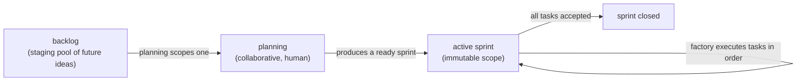

# RFC 005: Sprint-oriented planning — one active sprint, immutable scope, and the portfolio view

## Status

**Implemented (2026-07-25).** All four rollout steps landed: step 0 (the total `epic` → `sprint` rename, across `dab`, the factory, and every consuming repo's board — see [the migration plan](RFC_005_MIGRATION_PLAN.md)); phase 1 (the single-active-sprint `dab check` invariant + `dab sprint <name>` to activate); phase 2 (`decide()`'s backlog-assessment dispatch removed; the architect's only remaining factory-dispatch reasons are mediating a rejection and closing an exhausted sprint); phase 3 (the portfolio view's progress display fixed to a real done/total, read from the active sprint's `WORK_PLAN.md`). It spans two codebases — `dab` (now consolidated into a single repo, `docs-as-board`, no more git submodules) and the factory (`orchestrator.mjs` decision logic + the local UI). It was a *tightening* of how the factory already behaved (single-track, one unit of work at a time, level-triggered), not a rebuild.

**Decisions locked (were open forks in earlier drafts):** the single-active-sprint constraint is tracked as a **`dab` invariant**, not a factory-config field; the **backlog** is retained as the pre-sprint staging pool; the active sprint is **per repo** (not one global sprint); and a structured mechanism for capturing work discovered *mid-sprint* ("findings") is **dropped from this RFC** — if it proves needed it gets its own deep-dive RFC.

**Vocabulary note:** this RFC replaces the term **epic** entirely with **sprint**. The rename is total — folders, CLI, frontmatter, personas, orchestrator identifiers — see [Rollout](#rollout). "Epic" appears below only where it names the *old* thing being renamed.

## Motivation

Today the board mixes two kinds of work: **epic tasks** (ordered in a `WORK_PLAN.md`) and **loose standalone/backlog tasks**. That split causes friction and at least one known bug — `dab next` never reads `dab/todos/`, so a standalone task is invisible unless it's graduated into an epic or filed in backlog (see [[factory-operational-gotchas]] history and the note near [ADR 008](../architecture/adr/ADR_008_READ_ONLY_CHECKOUT_COMPLETION_IN_PR.md)). It also makes "what is the factory working on right now, across all repos?" hard to answer at a glance.

The goal: a single, opinionated planning model that (a) unifies all work under one concept — the **sprint** — (b) gives a crisp **cross-repo portfolio view** showing only what's currently relevant, and (c) structurally encodes the project's operating principle — *design is collaborative, execution is autonomous* — by making a sprint the handoff artifact between the two.

## The model in one breath

**Everything is a sprint** (the unit formerly called an *epic*) — a named folder with an ordered plan and its task specs. There are no loose/general tasks. Each repo has **exactly one active sprint** at a time, tracked as a `dab` invariant. A sprint's scope is **immutable once started** — no tasks are added mid-flight. A task is done when the **reviewer accepts it** (or the architect resolves a repeat rejection); the developer works the task until then. When the active sprint's tasks are all accepted, the sprint **closes**. The **backlog** is the pre-sprint staging pool from which future sprints — including named *maintenance* sprints — are scoped. The cross-repo **portfolio view** shows, per repo, the active sprint's current + upcoming tasks — nothing else.

## Non-goals

- **Multiple active sprints per repo, or parallel sprints.** Exactly one active sprint per repo is the whole point. (Parallelism *within* a sprint's tasks is a separate question — see [RFC 001](RFC_001_PARALLEL_TASK_EXECUTION.md).)
- **The factory doing sprint planning.** Planning is collaborative human work that *produces* a ready sprint. The factory only *consumes* one. This RFC deliberately *removes* the factory's current "assess/graduate a backlog item" behavior.
- **A structured mechanism for capturing mid-sprint discoveries.** Because scope is immutable, work uncovered *during* a sprint can't be added to it. How such work is captured for later (a "findings" mechanism) is **deliberately out of scope here** — for now it reaches the backlog by ordinary human capture; a dedicated RFC will design it if the need is real.
- **Governing every change to a repo.** The sprint governs *the factory's queue*, not every possible commit. Urgent human hotfixes (e.g. the 2026-07-22 dependency-audit fix landed directly on `main`) live outside the sprint model — see [Escape hatch](#escape-hatch).
- **A distributed/portfolio-wide single sprint.** "One active sprint" is *per repo*; the portfolio is each repo's active sprint side by side.

## Proposal

### 1. Everything is a sprint (unify the model)

Collapse "epic tasks" and "standalone/general tasks" into one concept: a **sprint** — a named folder `dab/sprints/<name>/` with an ordered plan (`WORK_PLAN.md`), an `overview.md`, and its task specs (`todos/`). Maintenance work is not a special perpetual bucket; it's a **named, finite maintenance sprint** (`maintenance-2026-q3`, etc.) you scope when there's enough of it to warrant one.

This erases the standalone-task special case: there is one code path — *"work the active sprint's next task."* `dab next` no longer needs a backlog branch; the known "`dab next` ignores `dab/todos/`" gap disappears by construction.

### 2. Exactly one active sprint per repo (a `dab` invariant)

"At most one active sprint per repo" is a **board invariant enforced by `dab check`** — not a factory-config value. Because `dab check` already runs as the repo's **pre-commit hook**, a board that activates a second sprint is *rejected at commit time*; the invariant enforces itself. The active sprint is the source of truth for "what the factory should work on"; the factory *observes* it rather than deciding it in config (consistent with [ADR 002](../architecture/adr/ADR_002_RECONCILE_STATE_FROM_REALITY.md) — derive state from reality).

Switching sprints is an explicit `dab` operation (`dab sprint <name>` to activate; `dab sprint close <name>` when done). That explicit step *is* the "decide the correct sprint" moment when (re)starting the factory.

### 3. Immutable scope

**No new tasks are added to a sprint once it has started.** This is what guarantees a sprint always closes (no moving goalposts). Completion is governed entirely by the review gate: **a task is done when the reviewer accepts it** — or, on a repeat rejection, when the architect resolves it — and the developer works the task until then. The reviewer is the sole arbiter of "is this task complete," judged against its spec; there is no separate rule policing what the developer must fix.

Work uncovered mid-sprint that's genuinely out of scope for the current tasks doesn't get folded into the plan (that would break immutability). Capturing such work in a structured way is out of scope for this RFC (see [Non-goals](#non-goals)); until a future RFC says otherwise, it's noted in the backlog by ordinary human capture.

### 4. The lifecycle loop



Planning pulls from the backlog to scope the next sprint; a **maintenance sprint** is just a sprint scoped from accumulated maintenance items in the backlog.

### 5. The planning / execution boundary (the sprint is the handoff artifact)

- **Planning** (human + assistant, collaborative): scope a sprint from the backlog — a named folder with an ordered, immutable plan. Output: a *ready* sprint.
- **Execution** (factory, autonomous): consume a ready sprint; implement / test / review / merge each task in order.

Consequence: the factory **sheds its backlog-assessment role.** The architect no longer graduates backlog items into sprints (that's planning). The architect's *execution-time* duties remain: mediate a repeat rejection, and propose sprint closure when the plan is exhausted. This is a real simplification and a crisper boundary — the existing operating principle (*design collaborative, execution autonomous*) made structural.

### 6. The cross-repo portfolio view

A **derived, read-only projection** built by the factory (which already reads every managed board each tick — [ADR 002](../architecture/adr/ADR_002_RECONCILE_STATE_FROM_REALITY.md)). It is **not** a second writer and does **not** move the source of truth out of the project repos. It extends the local control UI ([RFC 002](RFC_002_FACTORY_CONTROL_UI.md) / `server.mjs`).

Per repo, one card showing **only the active sprint** — current task + ordered upcoming, a progress count, nothing else (no other sprints, no backlog, no done-task detail):

```
┌ leanmacrofeed ──────────────────────────────┐   ┌ some-other-repo ─────────────────────┐
│ Sprint: indicator-source-registry   4/10 ✓  │   │ Sprint: maintenance-2026-q3    1/6 ✓ │
│ ▶ now:   revive_event_outcome_recorded_topic │   │ ▶ now:   bump-deps-and-audit         │
│   next:  migrate_event_ledger_…              │   │   next:  drop-dead-feature-flags     │
│          consolidate_delta_and_tier_logic    │   │          tighten-ci-timeouts         │
│          fix_fred_series_id_drift            │   │          …                           │
│          … parks at remove_legacy_…          │   └──────────────────────────────────────┘
└──────────────────────────────────────────────┘
```

Per repo (not one global sprint). "Only what's currently relevant" = the active sprint's now + next.

### 7. What this simplifies

- **`dab`:** one uniform `next` path (active sprint's next task); the standalone-todo gap is gone; `dab check` gains the single-active-sprint invariant; the whole `epic` vocabulary collapses to `sprint`.
- **`orchestrator.mjs` `decide()`:** the `next.source === 'backlog'` dispatch branch and the general/standalone special-cases disappear; `findClosableEpic` becomes `findClosableSprint` — "active sprint has no open tasks → propose close."
- **Roles:** the architect loses backlog-graduation. The completion contract is simply "developer works the task until the reviewer accepts it (or the architect resolves a repeat rejection)."

## Escape hatch

Not everything is a sprint. Genuine **hotfixes** — urgent, out-of-band changes a human makes directly (the 2026-07-22 audit fix on `main` is the canonical example) — live *outside* the factory's sprint queue. The sprint governs what the *factory* consumes, not every change to the repo.

## Alternatives considered

- **Keep the epic/standalone split, just add a portfolio view.** Rejected: the split is the source of the `dab next` gap and the "what's active?" ambiguity; unifying under sprints is what makes the view (and `decide()`) simple.
- **A perpetual "general" sprint** (an earlier draft). Rejected: a bucket that never closes needs special-case ordering/close semantics and re-introduces "mixing." Named, finite maintenance sprints are cleaner.
- **Mutable sprint scope** (append discovered tasks to the active sprint). Rejected: sprints then never close (moving goalposts). Immutability is the property that makes the whole model hold.
- **A structured findings mechanism for mid-sprint discoveries.** Considered and **deferred** — it's a real design with its own questions (capture command, schema, triage, urgent-severity escalation, conflict-safety under parallelism). Not needed to land the core model, so it's split out to its own future RFC rather than half-built here.
- **A "finding vs fix-now" rule** policing whether a discovery belongs to the current task. Rejected as redundant even before findings were deferred: the review gate already *is* the completeness authority — the reviewer won't accept a task that leaves an in-scope defect, so there's nothing to police separately.
- **Keep `epic` internally, say "sprint" only in the view.** Rejected: a half-rename leaves two words for one thing. The rename is total.
- **Active-sprint marker in the factory config** instead of a `dab` invariant. Rejected: it makes the factory the authority on "what's active" rather than the board — against [ADR 002](../architecture/adr/ADR_002_RECONCILE_STATE_FROM_REALITY.md).
- **Move the board (and its history) into the factory** (the question that started this design). Rejected: it breaks [ADR 008](../architecture/adr/ADR_008_READ_ONLY_CHECKOUT_COMPLETION_IN_PR.md) atomic completion-in-PR and the [ADR 002](../architecture/adr/ADR_002_RECONCILE_STATE_FROM_REALITY.md) controller/reality separation, and couples a multi-repo factory to every project's board. The portfolio view (a read-model) delivers the cross-repo visibility that motivated the question *without* relocating the source of truth.

## Risks & open questions

- **Immutability rigidity.** If a sprint's premise proves wrong mid-flight, you can't patch the plan — you abort/re-plan (a whole-sprint, human decision). That's intended, but it's a real cost to name. It also sharpens the deferred question: with no findings mechanism *and* immutable scope, a mid-sprint discovery relies on human capture to reach the backlog — fine at low volume, the trigger to write the findings RFC if it isn't.
- **Board write-contention under parallelism.** The active `WORK_PLAN`'s box-checks are a shared file; concurrent tasks would contend (ties into [RFC 001](RFC_001_PARALLEL_TASK_EXECUTION.md)). Not a problem at the current single-track cap.
- **Rename blast radius.** `epic` is threaded through `dab` (CLI, `dab/epics/`, frontmatter, `activeEpics`), the factory (`findClosableEpic`, `epic-close-*` ids, prompts, status rendering), the personas, and existing boards (LeanMacroFeed's `dab/epics/indicator-source-registry/`). The migration is mechanical but wide — do it as one atomic pass per surface, not piecemeal, to avoid a half-renamed board that `dab check` can't parse.

## Rollout

Phased across the two codebases; each phase is independently useful.

0. **The rename (`epic` → `sprint`), as one deliberate migration.** `dab`: `dab/epics/` → `dab/sprints/`, `dab epic …` → `dab sprint …`, frontmatter `epic:` → `sprint:`, `activeEpics` → `activeSprints`. Existing boards: move folders + rewrite frontmatter (LeanMacroFeed's live sprint). Factory: `findClosableEpic` → `findClosableSprint`, `epic-close-*` task ids, prompts, status labels. Personas: architect/developer/reviewer wording. Land it atomically per surface so no board is left half-renamed (which would break the pre-commit `dab check`).
1. **`dab` (the model):** single-active-sprint invariant + `dab check` rule. This fixes the standalone-todo gap and makes the board self-enforcing.
2. **Factory (execution):** simplify `decide()` (drop backlog-assessment, collapse general/standalone paths); the architect proposes sprint closure when the plan is exhausted.
3. **Portfolio view (visibility):** a factory-side read-model aggregating each repo's active sprint, surfaced in the local UI ([RFC 002](RFC_002_FACTORY_CONTROL_UI.md) / `server.mjs`) — read-only, derived, never a writer.

Same "earn the gate" posture as the rest of the factory: land the rename + `dab` invariant first (low-risk, immediately useful), then the execution simplification, then the view.
