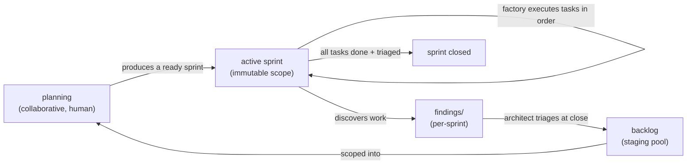

# RFC 005: Sprint-oriented planning — one active sprint, immutable scope, findings, and the portfolio view

## Status

**Proposed.** Design settled through a collaborative design session; not yet built. It spans two codebases — `dab` (the `docs-as-board` tool: the board model + invariants) and the factory (`orchestrator.mjs` decision logic + the local UI). It is a *tightening* of how the factory already behaves (single-track, one epic at a time, level-triggered), not a rebuild — most of the value is a cleaner model, a `dab` invariant, a findings mechanism, and a new read-only view.

## Motivation

Today the board mixes two kinds of work: **epic tasks** (ordered in a `WORK_PLAN.md`) and **loose standalone/backlog tasks**. That split causes friction and at least one known bug — `dab next` never reads `dab/todos/`, so a standalone task is invisible unless it's graduated into an epic or filed in backlog (see [[factory-operational-gotchas]] history and the note in [ADR 008](../architecture/adr/ADR_008_READ_ONLY_CHECKOUT_COMPLETION_IN_PR.md)'s vicinity). It also makes "what is the factory working on right now, across all repos?" hard to answer at a glance.

The goal: a single, opinionated planning model that (a) unifies all work under one concept, (b) gives a crisp **cross-repo portfolio view** showing only what's currently relevant, and (c) structurally encodes the project's operating principle — *design is collaborative, execution is autonomous* — by making a **sprint** the handoff artifact between the two.

## The model in one breath

**Everything is a sprint.** A sprint is an epic is a folder — 1:1:1. There are no loose/general tasks. Each repo has **exactly one active sprint** at a time. A sprint's scope is **immutable once started** — no tasks are added mid-flight. Work discovered *during* a sprint is captured as **findings** (not tasks), which the architect triages into the **backlog** at sprint close; the backlog is the pool from which future sprints (including named *maintenance* sprints) are scoped. The cross-repo **portfolio view** shows, per repo, the active sprint's current + upcoming tasks — nothing else.

## Non-goals

- **Multiple active sprints per repo, or parallel sprints.** Exactly one active sprint per repo is the whole point. (Parallelism *within* a sprint's tasks is a separate question — see [RFC 001](RFC_001_PARALLEL_TASK_EXECUTION.md).)
- **The factory doing sprint planning.** Planning is collaborative human work that *produces* a ready sprint. The factory only *consumes* one. This RFC deliberately *removes* the factory's current "assess/graduate a backlog item" behavior.
- **Governing every change to a repo.** The sprint governs *the factory's queue*, not every possible commit. Urgent human hotfixes (e.g. the 2026-07-22 dependency-audit fix landed directly on `main`) live outside the sprint model — see [Escape hatch](#escape-hatch).
- **A distributed/portfolio-wide single sprint.** "One active sprint" is *per repo*; the portfolio is each repo's active sprint side by side.

## Proposal

### 1. Everything is a sprint (unify the model)

Collapse "epic tasks" and "standalone/general tasks" into one concept: a **sprint** — a named folder (`dab/epics/<name>/` today, possibly `dab/sprints/<name>/`) with an ordered plan and its task specs. Maintenance work is not a special perpetual bucket; it's a **named, finite maintenance sprint** (`maintenance-2026-q3`, etc.) you scope when there's enough of it to warrant one.

This erases the standalone-task special case: there is one code path — *"work the active sprint's next task."* `dab next` no longer needs a backlog branch; the known "`dab next` ignores `dab/todos/`" gap disappears by construction.

### 2. Exactly one active sprint per repo (a `dab` invariant)

Make "at most one active sprint per repo" a **board invariant enforced by `dab check`**. Because `dab check` already runs as the repo's **pre-commit hook**, a board that activates a second sprint is *rejected at commit time* — the invariant enforces itself. The active sprint is the source of truth for "what the factory should work on"; the factory *observes* it rather than deciding it in config (consistent with [ADR 002](../architecture/adr/ADR_002_RECONCILE_STATE_FROM_REALITY.md) — derive state from reality).

Switching sprints is an explicit `dab` operation (`dab sprint <name>` / activate + close-or-pause the prior). That explicit step *is* the "decide the correct sprint" moment when (re)starting the factory.

### 3. Immutable scope + the findings mechanism

**No new tasks are added to a sprint once it has started.** This is what guarantees a sprint always closes (no moving goalposts). Work discovered mid-sprint — bugs, weaknesses, security issues, refactors, improvements, anything that *could* become a task — is recorded as a **finding**, not folded into the plan. Three rules make this safe:

**Rule 1 — A finding is not a way to defer your own task's defects (reviewer-enforced).** This is the load-bearing rule; without it, sprints "complete" with a growing pile of punted defects.
- *Pre-existing / out-of-scope* issue you noticed → **finding**.
- Something *your task introduced or owns* → **fix now, in-sprint** (that's not a new task, it's completing your task correctly).
The **reviewer** guards this line on every PR.

**Rule 2 — Urgent findings ring the bell immediately.** Since triage happens at sprint *close*, a finding otherwise sits silently until then — unacceptable for a critical security issue. Each finding carries a `severity`; a high-severity one fires an immediate `notify()` (decoupled from close-time triage) so a human can decide: hotfix directly (escape hatch) or abort/re-plan the sprint.

**Rule 3 — Structured and conflict-safe.**
- **One file per finding** in `dab/<sprint>/findings/`, *not* a single `FINDINGS.md` — a shared append-file is a merge-conflict hotspot the moment two tasks touch it, and a hard blocker under future parallelism ([RFC 001](RFC_001_PARALLEL_TASK_EXECUTION.md)). Same rationale as `dab`'s one-file-per-task.
- **Light schema per finding**: `id`, `title`, `category` (bug / security / tech-debt / improvement), `severity`, `source` (task + `file:line`), `discovered-by` (role), `description`. Makes the architect's triage a fast, near-mechanical pass — "file to backlog" becomes almost a move.
- Findings **ride in the same PR** as the task that surfaced them (append-as-you-go, reviewed, lands atomically — consistent with completion-in-PR, [ADR 008](../architecture/adr/ADR_008_READ_ONLY_CHECKOUT_COMPLETION_IN_PR.md)).

The bar for "is this a finding?": *would it plausibly become a future task?* Not "here's a stray thought." The reviewer and the architect's triage prune noise.

### 4. The lifecycle loop

Findings are not a dead-letter box — they are the *source* of future sprints, which closes the loop the "maintenance sprint" idea opened:



A future **maintenance sprint** is assembled from accumulated backlog findings — it isn't conjured from nowhere.

### 5. The planning / execution boundary (the sprint is the handoff artifact)

- **Planning** (human + assistant, collaborative): scope a sprint from the backlog — a named folder with an ordered, immutable plan. Output: a *ready* sprint.
- **Execution** (factory, autonomous): consume a ready sprint; implement / test / review / merge each task in order.

Consequence: the factory **sheds its backlog-assessment role.** The architect no longer graduates backlog items into epics (that's planning). The architect's *execution-time* duties remain: mediate a 2nd rejection, **triage findings + propose sprint closure**. This is a real simplification and a crisper boundary — and it's the existing operating principle (*design collaborative, execution autonomous*) made structural.

### 6. The cross-repo portfolio view

A **derived, read-only projection** built by the factory (which already reads every managed board each tick — [ADR 002](../architecture/adr/ADR_002_RECONCILE_STATE_FROM_REALITY.md)). It is **not** a second writer and does **not** move the source of truth out of the project repos. It extends the local control UI ([RFC 002](RFC_002_FACTORY_CONTROL_UI.md) / `server.mjs`).

Per repo, one card showing **only the active sprint** — current task + ordered upcoming, a progress count, nothing else (no other sprints, no backlog, no done-task detail):

```
┌ leanmacrofeed ──────────────────────────────┐   ┌ some-other-repo ─────────────────────┐
│ Sprint: indicator-source-registry   4/10 ✓  │   │ Sprint: maintenance-2026-q3    1/6 ✓ │
│ ▶ now:   revive_event_outcome_recorded_topic │   │ ▶ now:   bump-deps-and-audit         │
│   next:  migrate_event_ledger_…              │   │   next:  drop-dead-feature-flags     │
│          consolidate_delta_and_tier_logic    │   │          tighten-ci-timeouts         │
│          fix_fred_series_id_drift            │   │          …                           │
│          … parks at remove_legacy_…          │   └──────────────────────────────────────┘
└──────────────────────────────────────────────┘
```

"Only what's currently relevant" = the active sprint's now + next, per repo.

### 7. What this simplifies

- **`dab`:** one uniform `next` path (active sprint's next task); the standalone-todo gap is gone; `dab check` gains the single-active-sprint invariant.
- **`orchestrator.mjs` `decide()`:** the `next.source === 'backlog'` dispatch branch and the general/standalone special-cases disappear; `findClosableEpic` simplifies to "active sprint has no open tasks → propose close (after findings triage)."
- **Roles:** the architect loses backlog-graduation; gains findings-triage-at-close. Developer/reviewer gain the finding-vs-fix-now discipline (Rule 1).

## Escape hatch

Not everything is a sprint. Genuine **hotfixes** — urgent, out-of-band changes a human makes directly (the 2026-07-22 audit fix on `main` is the canonical example) — live *outside* the factory's sprint queue. The sprint governs what the *factory* consumes, not every change to the repo. High-severity findings (Rule 2) are the trigger that surfaces "this may need a hotfix" to a human.

## Alternatives considered

- **Keep the epic/standalone split, just add a portfolio view.** Rejected: the split is the source of the `dab next` gap and the "what's active?" ambiguity; unifying under sprints is what makes the view (and `decide()`) simple.
- **A perpetual "general" epic** (an earlier draft of this design). Rejected: a bucket that never closes needs special-case ordering/close semantics and re-introduces "mixing." Named, finite maintenance sprints are cleaner.
- **Mutable sprint scope** (append discovered tasks to the active sprint). Rejected: sprints then never close (moving goalposts), and it becomes a channel for agents to punt their own defects. The findings mechanism captures discoveries without touching scope.
- **Active-sprint marker in the factory config** instead of a `dab` invariant. Tempting (matches `stopAfterTask`), but it makes the factory the authority on "what's active" rather than the board — against [ADR 002](../architecture/adr/ADR_002_RECONCILE_STATE_FROM_REALITY.md). Left as an open fork below, leaning `dab`-invariant.
- **Move the board (and its history) into the factory** (the question that started this). Rejected earlier in the design: it breaks [ADR 008](../architecture/adr/ADR_008_READ_ONLY_CHECKOUT_COMPLETION_IN_PR.md) atomic completion-in-PR and the [ADR 002](../architecture/adr/ADR_002_RECONCILE_STATE_FROM_REALITY.md) controller/reality separation, and couples a multi-repo factory to every project's board. The portfolio view (a read-model) delivers the cross-repo visibility that motivated the question *without* relocating the source of truth.

## Risks & open questions

**Risks**
- **Scope-discipline leak (the big one).** Rule 1 is only as good as the reviewer's enforcement of finding-vs-fix-now. If it slips, sprints complete with deferred defects. Needs to be explicit in the reviewer persona.
- **Findings noise.** Agents over-reporting trivia. Mitigated by the "could become a task?" bar + triage pruning, but worth watching.
- **Urgent-finding latency.** Rule 2's `notify()` must actually reach a human; a missed notification means a critical issue waits until close.
- **Immutability rigidity.** If a sprint's premise proves wrong mid-flight, you can't patch the plan — you abort/re-plan (a whole-sprint, human decision). That's intended, but it's a real cost to name.
- **Board write-contention under parallelism.** The active plan + findings are shared files; one-file-per-finding mitigates findings, but concurrent `WORK_PLAN` box-checks still contend (ties into [RFC 001](RFC_001_PARALLEL_TASK_EXECUTION.md)).

**Open forks (decide before building)**
1. **Vocabulary:** rename `epic`→`sprint` in `dab` (CLI, folders), or keep `epic` internally and surface "sprint" only in the view? (Real change vs cosmetic.)
2. **Active-sprint marker:** `dab` invariant (leaning this) vs factory-config field.
3. **Backlog:** confirmed to remain as the pre-sprint staging pool (not shown in the portfolio) — the capture surface for future ideas + triaged findings.
4. **Findings capture mechanism:** a `dab finding add` command (structured, low-friction) vs raw markdown files agents author directly.
5. **Per-repo active sprint** (assumed) — the portfolio is each repo's active sprint, not one global sprint.

## Rollout

Phased across the two codebases; each phase is independently useful.

1. **`dab` (the model):** single-active-sprint invariant + `dab check` rule; `findings/` dir + schema + `dab finding add`; decide the `epic`→`sprint` vocabulary question. This alone fixes the standalone-todo gap and makes the board self-enforcing.
2. **Factory (execution):** simplify `decide()` (drop backlog-assessment, collapse general/standalone paths); add the architect's findings-triage-at-close step; wire high-severity findings to `notify()`; teach the reviewer persona Rule 1 (finding vs fix-now).
3. **Portfolio view (visibility):** a factory-side read-model aggregating each repo's active sprint, surfaced in the local UI ([RFC 002](RFC_002_FACTORY_CONTROL_UI.md) / `server.mjs`) — read-only, derived, never a writer.

Same "earn the gate" posture as the rest of the factory: land the `dab` invariant and findings capture first (low-risk, immediately useful), then the execution simplifications, then the view.
